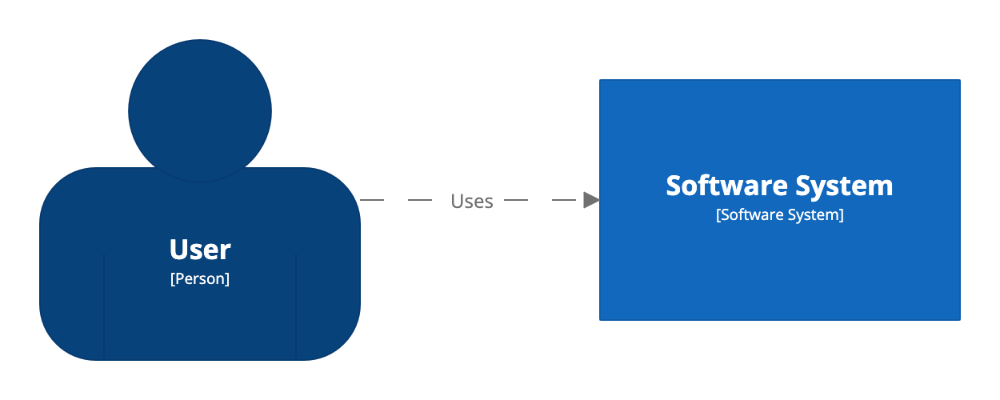
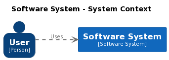

# Getting started

The Structurizr CLI provides tooling to parse [Structurizr DSL](https://github.com/structurizr/dsl)
workspace definitions, upload them to the Structurizr cloud service/on-premises installation,
and [export diagrams to other formats](export.md) (e.g. PlantUML, Mermaid, D2, DOT, WebSequenceDiagrams, etc).

This getting started guide assumes that you have the CLI installed locally and available on your operating system's path,
so you'll need to tweak the example commands if you're using Docker or you've installed the CLI via a package manager.

## 1. Create a software architecture model with the DSL

Create a new empty file with your favourite text editor, and copy the following text into it.

```
workspace {

    model {
        user = person "User"
        softwareSystem = softwareSystem "Software System"

        user -> softwareSystem "Uses"
    }

    views {
        systemContext softwareSystem "SystemContext" {
            include *
            autoLayout lr
        }

        styles {
            element "Software System" {
                background #1168bd
                color #ffffff
            }
            element "Person" {
                shape person
                background #08427b
                color #ffffff
            }
        }
    }
    
}
```

Save this file into the current directory as `workspace.dsl`.

This DSL definition:

- creates a person named "User"
- creates a software system named "Software System"
- creates a relationship between the person and the software system
- create a System Context view for the software system
- creates some element styles that will be applied when rendering the diagram

Please note that the Structurizr CLI will create some default views for you if you don't define them yourself in the DSL.
See [Defaults](defaults.md) for more details.

## 2. Render with Structurizr, or export to other diagram formats

You can now either render your diagrams with the Structurizr cloud service/on-premises installation,
or render your diagrams with another tool (e.g. PlantUML, Mermaid, etc).

### Upload and render with the Structurizr cloud service/on-premises installation

If you've not done so, follow [Structurizr - Getting started](https://structurizr.com/help/getting-started) to sign up
for a free Structurizr account, and create a workspace.
To upload your workspace to the Structurizr cloud service/on-premises installation,
you will need your workspace ID, API key and secret.
See [Structurizr - Workspaces](https://structurizr.com/help/workspaces) for information about finding these.

Open a terminal, and issue the following command to upload the workspace:

```
./structurizr.sh push -id WORKSPACE_ID -key KEY -secret SECRET -workspace workspace.dsl
```

or

```
structurizr push -id WORKSPACE_ID -key KEY -secret SECRET -workspace workspace.dsl
```

- WORKSPACE_ID: your workspace ID
- API_KEY: your API key
- API_SECRET: your API secret

You can now sign in to your Structurizr account, and open the workspace
from your dashboard. Your workspace should now contain a diagram like this:



### Export and render to other diagram formats

Alternatively, you can export the views defined in your DSL workspace definition to a number of other formats, for rendering with other tools. You do not need a Structurizr account to do this. For example, to export the views to PlantUML format:

```
./structurizr.sh export -workspace workspace.dsl -format plantuml
```

or

```
structurizr export -workspace workspace.dsl -format plantuml
```

This will create one PlantUML definition per view, which you can then render using the PlantUML tool.



See the [export](export.md) command for more details on exporting diagrams, and the various supported formats.